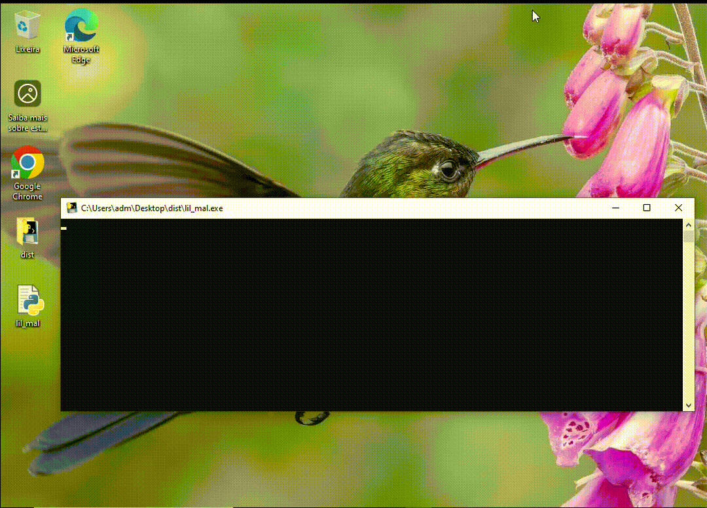
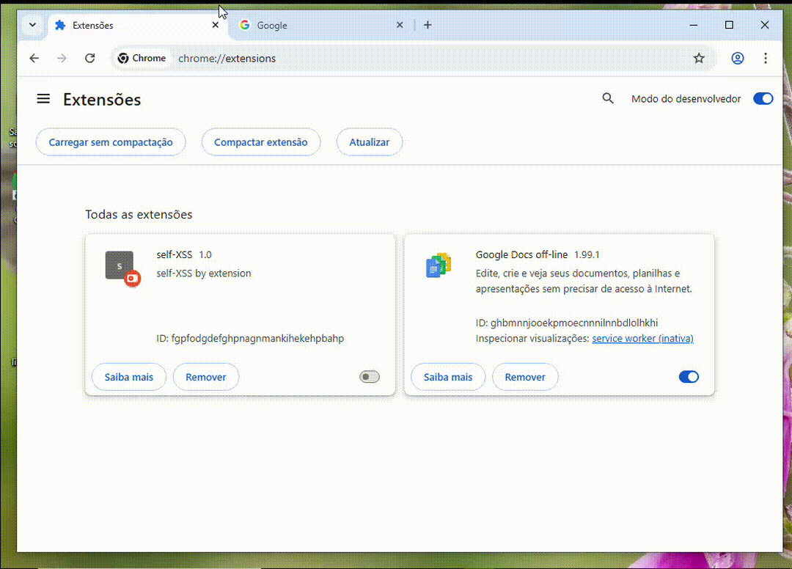

# Abusando de comportamentos esperados, mas inseguros do navegador Chrome (CWE-693)

O navegador google chrome em sua última versão (143.0.7499.169) apresenta a possibilidade de explorar o bypass de um mecanismo de proteção na omnibox. Por padrão o utilitário implementa uma sanitização que bloqueia a cópia direta de termos que executam código javascript, mas a implementação falha quando isso é feito por partes via malware ou utilizando código html. Sendo assim, a partir de uma máquina rodando um script, ou de um navegador com uma extensão maliciosa, um atacante em potencial pode obter dados de navegação de sites acessados pela vítima. 

Neste repositório serão analisados como explorar esta fraquesa a partir de diferentes vetores de ataque se aproveitando da má implementação do mecanismo de defesa do navegador. Vale lembrar que os procedimentos demonstrados, bem como os scripts apresentados tem como finalidade a informação e educação dos usuários sobre os riscos de exposição durante o acesso a um site que parece ser inofensivo, ou quanto ao uso de navegadores específicos em dispositivos de terceiros.

Todas as frequezas publicadas aqui foram devidamente reportadas e consideradas como comportamento esperado pelas partes interessadas, não sendo realizado qualquer tipo de correção na versão atual do navegador. Todas as técnicas apresentadas partem do présuposto de uma máquina já comprometida e mostra como prova de conceito os riscos de utilizar navegadores como o chrome em dispositivos compartilhados. 

## Vetores de ataque

Durante as pesquisas desenvolvidas sobre a injeção de código no omnibox do navegador, foram verificadas duas possibilidades de exploração. Os vetores utilizados foram os parâmetros html "location.href" e a inserção gradativa do payload no campo disponível. O primeiro pode realizar a execusão de código remoto somente com a visita da vítima a uma página, possibilitando que o atacante acesse inclusive uma shell no navegador, o segundo abusa da má sanitização na omnibox para realizar XSS em qualquer site visitado pela vítima a partir de uma máquina comprometida. Sendo assim podemos classificar como meio de exploração os seguintes payloads:

- location.href = javascript:alert(document.domain)
- "javascript",":alert(document.domain)"

### Self-XSS via Malware

Como dito antes o google chrome consegue proteger o usuário quando a string "javascript:alert(documen.domain)" é colada diretamente na omnibox. No entanto essa proteção falha quando o código é inserido por partes, permitindo a execução de código arbitŕario em qualquer site visitado pela vítima em uma máquina comprometida. Esta técnica também pode ser chamada de self-XSS, quando a injeção do código é realizda a partir da perpectiva do usuário legítimo. Apesar de parecer inofensivo e demandar o comprometimento de uma máquina utilizada pela vítima, o abuso deste comportamento pode ser devastador em cenário de pós exploração.

Para a prova de conceito pode-se criar um pequeno script em python que identifica o uso do navegador chrome em sobreposiçao e realiza comandos em caso afirmativo. Basicamente os comandos definidos são o acesso a omnibox e a inclusão por partes do payload por um tempor determinado. Assim os mecanismos de proteção do chrome não vai conseguir barrar a execução do código dentro do domínio visitado pelo alvo. O malware demonstrativo realiza as ações descritas em um tempo relativamente longo que permite visualizar a execução no código, no entando pequenas alterações no espçamento de uma ação para outra é suficiente para ser imperceptível ao usuário. 

- [Lil_mal](lil_mal.py)

### Self-XSS via extensão maliciosa

Além do ataque via malware, outra forma de executar o XSS explorando a fraqueza do navegador é via extensão maliciosa. Neste contexto a vítima pode ser induzida a instalar a extensão no navegador ou ter o código de alguma extensão já existente alterado por mudança de finalidade. Diferente da injeção de código na omnibox demonstrado anteriormente, uma extensão maliciosa que busca executar código em qualquer site visitado pela vítima utiliza a função html **location.href** e abusa da herança concedida à página about:blank.

Sendo assim com o falso utilitário instalado no navegador em modo de desenvolvedor, para qualquer site visitado, uma nova aba será aberta. Esta aba tenta forçar uma interação para que usuário intereja com os botões. Ao clicar neste elemento o código é executado em cima da página visitada devido à herança do about:blank. Alguns sites podem bloquear esta ação através do controle de pop-up do próprio navegador. Neste caso uma permissão será solicitada.

- [mal_ext Content](mal_ext/Content.js)
- [mal_ext  Manifest](mal_ext/manifest.js)

### Chrome shell via malicious site

Outro comportamento esperado, mas que trás riscos ao usuário é a execusão de código no navegador durante o ato de visitar uma página. Neste contexto uma vítima pode executar código involuntário em seu navegador somente ao clicar em um link. A execusão de código aqui também funciona através do elemento **location.href** que carrega o payload a ser executado na omnibox do usuário. 

No caso em questão ao clicar em um link qualquer o script de um simples html carrega um payload que pode permitir acesso malicioso a shell javascript na aba executada do usuário ou executar códigos involuntários conforme as intenções do atacante. 

- [mal_page.html](mal_page.html)

